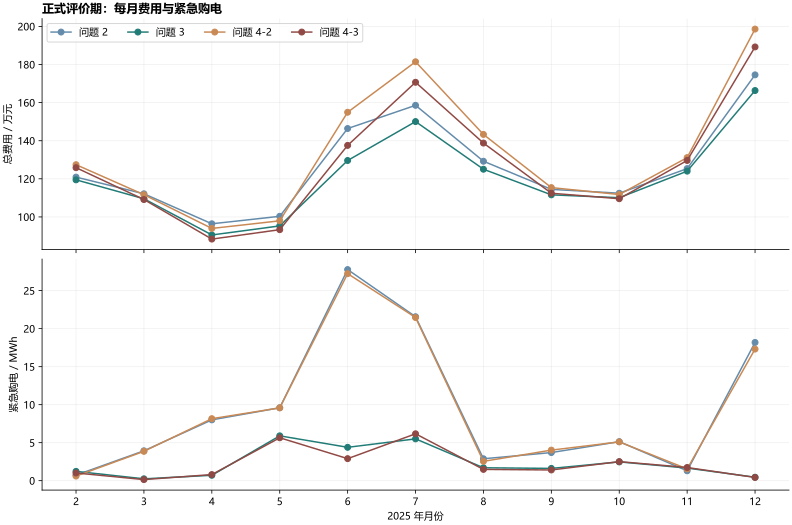

# 2026 全国大学生数学建模竞赛 C 题：微网与外部电网电力调控策略

本仓库为比赛结束后的项目归档，整理微网购电与储能调度问题的建模思路、计算程序、论文、结果表格及验证记录，供学习、复现与交流。

围绕光伏、负载预测和电价变化，项目从确定性单日优化出发，逐步构建日前购电、日内滚动调整与实时储能反馈策略，并通过独立验算检查物理约束、交易结算和信息可用时点。

## 快速阅读

- **[论文 PDF](outputs/deliverables/microgrid-paper.pdf)**：完整建模与结果分析；[LaTeX 源码](paper/main.tex)。
- **[在线完整解答](docs/solution.md)**：四问思路、公式、数值结果与敏感性分析。
- **[结果文件](outputs/deliverables/)**：五份 Excel 与论文；支撑材料 ZIP 可按下文命令生成。
- **[建模决策](docs/modeling/decisions.md)** 与 **[数据审计](docs/modeling/data-audit.md)**：假设、数据口径及处理依据。

## 方法概览

| 问题 | 场景 | 方法 |
| --- | --- | --- |
| 1 | 确定性单日、储能日循环 | 线性规划（LP），并用混合整数线性规划（MILP）交叉验证 |
| 2 | 固定电价、无日内调整 | 历史预测、风险分位日前规划、实时安全反馈 |
| 3 | 固定电价、允许日内调整 | 融合历史光伏与附件预报，滚动重规划与反馈调度 |
| 4 | 波动电价 | 在第二、三问框架中加入因果电价预测，按真实价格结算 |

计算采用 10 分钟时间步长，功率单位为 kW，电量为 kWh，价格为元/kWh。储能荷电状态（SOC）逐日连续承接，计划只使用决策时刻已到达的信息。公共优化、预测与结算位于 [scripts/model.py](scripts/model.py)，各问入口为 `q1.py` 至 `q4.py`。

补充实验覆盖预报信息贡献、历史基准、交易合约解释、价格感知反馈、跨月选参，以及储能参数与预测价差敏感性。具体设计与结果见[第一轮评审回应](docs/reviews/review-response.md)、[第二轮评审回应](docs/reviews/round2-response.md)和[实验目录](outputs/experiments/)。这些记录是项目内部审查与修订材料。

## 主要结果

| 问题 | 文件 | 正式评价期总费用 |
| --- | --- | ---: |
| 1：确定性日循环 | [result1.xlsx](outputs/deliverables/result1.xlsx) | 35,126.95 元/天 |
| 2：固定电价，无日内调整 | [result2.xlsx](outputs/deliverables/result2.xlsx) | 13,908,175.95 元 |
| 3：固定电价，有日内调整 | [result3.xlsx](outputs/deliverables/result3.xlsx) | 13,315,835.99 元 |
| 4-2：波动电价，无日内调整 | [result4-2.xlsx](outputs/deliverables/result4-2.xlsx) | 14,675,844.87 元 |
| 4-3：波动电价，有日内调整 | [result4-3.xlsx](outputs/deliverables/result4-3.xlsx) | 14,044,885.25 元 |

后四项覆盖 **2025-02-01 至 2025-12-31，共 334 天**，包含计划、调整及紧急购电费用；每日实际 SOC 从 1 月 1 日的 6000 kWh 连续承接。完整费用分解见 [summary.json](outputs/main/summary.json)。



### 结果适用边界

- **最优性**：问题一具有 LP/MILP 最优性验证；其余问题为因果预测与反馈调度的可行启发式，物理可行和结算正确不代表随机全局最优。
- **验证范围**：主参数仅使用 1 月选取，但模型族在查看全年评审反例后扩展，因此属于同年再分析。尚未获得真正未见过的外部年度数据；[外部验证协议](docs/modeling/external-validation-protocol.md)与合成输入检查不能替代外部经济效果验证。
- **交易假设**：主结果按交付段最终净调整结算一次，未交付增购可撤回；逐笔已成交增购不可免费撤回的合约，另行报告冻结调度重计费与重新优化结果。
- **储能与价格**：充、放电单向效率均为 90%，不售电，可放弃未利用电量；原计划付费不退款。波动价格按历史预测决策、真实价格结算。其他解释见敏感性分析。
- **Excel 费用口径**：后四份工作簿的计划表列出原计划费，调整表列出原计划费加调整增量费，不含紧急费用；两张表的费用不能再次相加。完整总费用以论文及 JSON 为准。

输入时间标签 `00:10` 表示 `00:00–00:10`，功率乘以 1/6 小时得到区间电量。输出修正了模板时间头的 10 分钟偏移，未旋转数据；详见 [Excel 模板说明](docs/modeling/template-spec.md)。

## 仓库结构

| 路径 | 内容 |
| --- | --- |
| `problem/`、`data/raw/` | 原始题目、附件与空白模板，保持原样 |
| `data/processed/` | 对齐数组、统计及审计哈希 |
| `scripts/` | 预处理、求解、回测、验证与导出 |
| `docs/solution.md` | 完整 Markdown 解答 |
| `docs/modeling/`、`docs/reviews/` | 建模决策、数据口径、评审与验证协议 |
| `docs/paper/`、`paper/` | 写作与格式记录、LaTeX 源码及生成表格 |
| `outputs/deliverables/` | 最终 PDF、五份 Excel 和支撑材料 ZIP |
| `outputs/main/` | 主结果、逐段调度归档及独立验算 |
| `outputs/experiments/` | 修订、第二轮及论文补充实验 |
| `outputs/verification/` | 工作簿、论文、打包与复现验收记录 |
| `outputs/figures/` | 图表与矢量版本 |
| `tmp/` | 临时文件，不纳入版本控制 |

## 计算复现

以下命令在仓库根目录执行。数值计算环境为 **Python 3.14**，依赖版本固定在 [requirements.txt](requirements.txt)。建议使用独立虚拟环境。

### 1. 主结果与独立验算

```powershell
python -m venv .venv
.venv/Scripts/Activate.ps1
python -m pip install -r requirements.txt
python scripts/prepare_data.py
python scripts/solve.py
python scripts/test_contracts.py
python scripts/test_feedback.py
python scripts/test_external_inputs.py
python scripts/validate_results.py
python scripts/validate_revision.py
python scripts/verify_q1_milp.py
python scripts/build_report.py
```

上例使用 PowerShell；其他系统需按对应 shell 激活虚拟环境。`solve.py` 完成四问主策略、参数选择及第一轮修订实验；耗时因机器而异，运行时间记录在 `outputs/main/summary.json`。`build_report.py` 更新 Markdown 解答、图表和本页费用表。

各问也可通过 `python scripts/q1.py` 至 `python scripts/q4.py` 单独运行，默认输出至 `outputs/questions/`，支持 `--data` 和 `--output`。单问输出不覆盖正式结果，也不包含完整补充实验；生成正式 Excel 仍需总入口及独立验算。

### 2. 第二轮补充实验

```powershell
python scripts/evaluate_round2.py
python scripts/validate_round2.py
python scripts/build_report.py --markdown-only
```

实验输出至 `outputs/experiments/round2/`，不覆盖主结果。外部年度数据入口及输入格式见[外部验证协议](docs/modeling/external-validation-protocol.md)。

### 3. Excel 导出

导出器使用 **Codex 内置 Node.js 与 `@oai/artifact-tool`** 导入附件模板、重算、渲染并导出。仅安装 Python 依赖无法完成此步骤；openpyxl 仅用于读取与独立核对工作簿。

已具备该运行时的环境可配置以下路径；请将占位值替换为实际绝对路径：

```powershell
$artifactNode = '<Node 可执行文件路径>'
$env:CODEX_BUNDLED_NODE_MODULES = '<包含 @oai/artifact-tool 的 node_modules 目录>'
$env:CODEX_BUNDLED_PYTHON = '<已安装 openpyxl 的 Python 可执行文件路径>'
& $artifactNode scripts/export_results.mjs
& $artifactNode scripts/export_results.mjs --verify
```

导出器支持 `--inspect` 与 `--preview-saved`。没有该运行时也可以运行 Python 数值计算和验算，并直接查看仓库中已导出的 Excel。

### 4. 论文与支撑材料

论文采用 [CUMCMThesis](https://github.com/latexstudio/CUMCMThesis)，固定版本及哈希见 [template-source.json](paper/template-source.json)，本地排版设置见[模板适配说明](docs/paper/template-adaptation.md)。编译要求 PATH 中可用 XeLaTeX 和 BibTeX。

```powershell
python scripts/evaluate_paper_sensitivity.py
python scripts/validate_paper_sensitivity.py
python scripts/build_paper.py
python scripts/build_supporting_materials.py
python scripts/build_supporting_materials.py --verify
```

论文构建会核对表格来源并生成 PDF。只修改文字或分页且图表来源未变时，可使用 `build_paper.py --skip-tables`。支撑材料包按比赛交付设置包含 13 个程序与 5 份 Excel；完整复现请使用本仓库，包内不含依赖清单与全部数据。详见[打包说明](docs/supporting-materials.md)。

## 验证记录

计算与独立验算分开执行。仓库保留以下记录，便于追溯对应产物与检查范围；重新计算或修改后应重新运行相关验证。

| 验证范围 | 记录 |
| --- | --- |
| 物理约束、结算与信息因果性 | [主结果验证](outputs/main/validation.json) |
| 问题一最优性交叉核验 | [MILP 验证](outputs/main/q1-milp-verification.json) |
| 修订实验与第二轮实验 | [修订验证](outputs/experiments/revision/validation.json)、[第二轮验证](outputs/experiments/round2/validation.json) |
| 五份 Excel 全量值对照 | [工作簿验证](outputs/verification/workbook-verification.json) |
| 论文与表格格式 | [论文验证](outputs/verification/paper-validation.json)、[逐表验收](outputs/verification/table-style-validation.json) |
| 历史定稿源码重放 | [复现记录](outputs/verification/reproduction-validation.json) |

历史复现记录针对当时的源码与产物，不等同于所有后续版本均已重放验证。Excel 已保存核对与渲染记录，未做桌面 Excel 交互式复算；修改论文后仍需检查实际 PDF 渲染。

## 项目说明

本仓库展示本队的建模方案与实验结果。AI 工具使用情况见[论文中的声明](paper/main.tex)，建模假设、方案取舍与结论以论文及决策记录为准。

题目、附件及上游 LaTeX 模板的来源与权利归其各自权利人。本仓库目前未附开源许可证；公开可见不等于授予代码、论文或数据的任意再分发授权。
