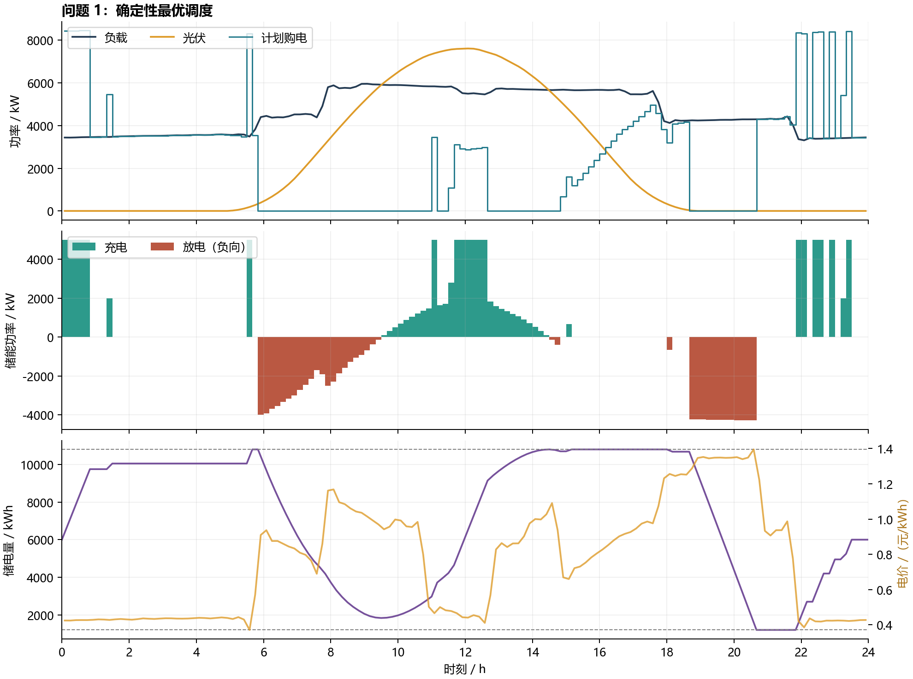
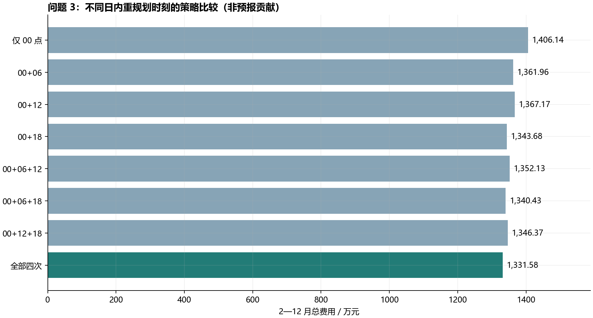
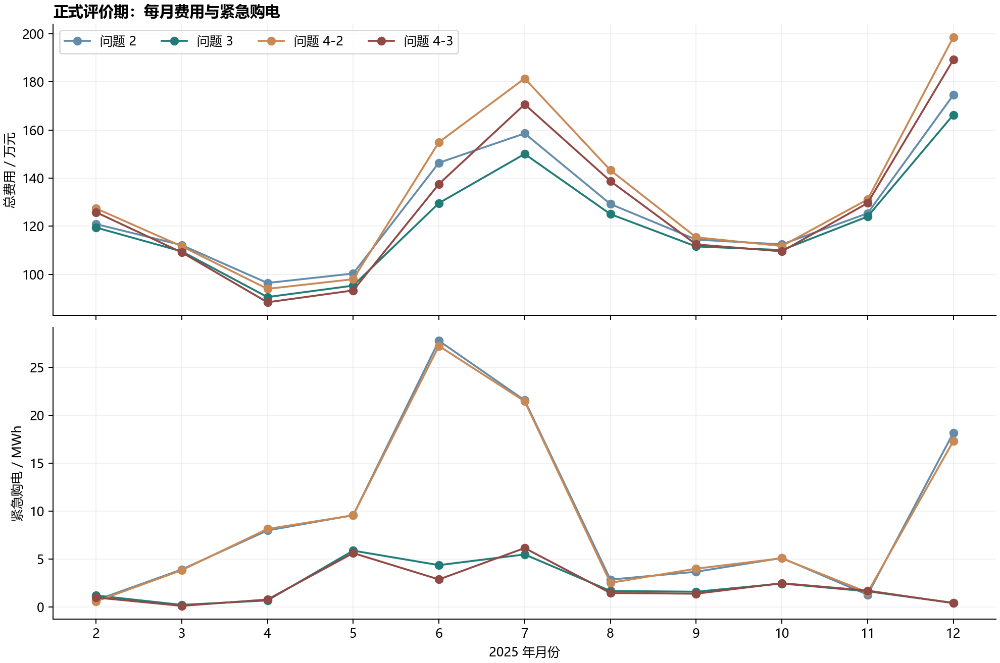

# 微网与外部电网电力调控策略：模型、计算与可复现结果

## 摘要

本文完成题目四问，以 10 分钟为步长，统一描述电力平衡、储能损耗与购电结算。问题 1 在给定预测和日循环边界下用线性规划求得全局最优，全天购电 **59,482.70 kWh**，购电费 **35,126.95 元**。独立加入充放电互斥的混合整数规划得到相同目标值。

问题 2—4 采用“历史预测—风险分位规划—实时安全反馈”的可行策略。所有计划只使用决策时刻已到达的信息；1 月用于训练、参数验证及从 6000 kWh 开始的热启动，正式结果覆盖 2025 年 2 月 1 日至 12 月 31 日，共 334 天、48,096 个区间。固定电价下，问题 3 总费用比问题 2 减少 **592,339.96 元（4.26%）**；波动电价下减少 **630,959.63 元（4.30%）**。紧急电计入费用并消除缺供，储电量逐日连续。

后续问题包含预测误差和控制近似，本文不声称其结果为严格随机全局最优。修订版增加历史光伏与附件 3 的融合候选，参数仍只按 1 月费用选择；但候选模型族是在评审已有全年结果后扩展，因此本次属于同一数据集上的再分析，不能称为新的独立测试或前瞻验证。费用优势还以未交付增购可撤回、按最终净调整结算的主合约为前提；逐笔收费合约另行优化并报告。

**关键词：** 微网；储能调度；线性规划；因果回测；风险分位；实时电价。

## 1. 题目理解与数据审查

题面为 [C 题 PDF](../problem/C题.pdf)，原始输入为 [附件目录](../data/raw/)。完整审计见 [数据审计](data-audit.md)，计算前的判断与修正过程见 [决策记录](decisions.md)，初次方法审查见 [模型审查](model-review.md)，后续反向评审及修订回应见 [评审回应](review-response.md)。

附件 1 有 144 条电价、负载、光伏预测；附件 2 有全年 365×144 条实际负载和光伏；附件 3 有 365×4×24 个小时预报；附件 4 有 365×144 条实际电价。所需数值无缺失、负数和非有限值，日期连续。原始文件 SHA-256 已保存并在验收时重核。

有四项容易改变答案的细节：

1. 输入的第一个时点为 00:10，最后一个为次日 00:00。主计算将右端记录代表此前 10 分钟的平均功率，功率除以 6 转为电量。题面未明确平均/瞬时语义，因此另做梯形积分敏感性。
2. 附件 5 模板却把第一个区间写成 00:10–00:20，整体偏移 10 分钟。交付文件保留模板结构，并将 144 个标签修正为 **00:00–00:10 至 23:50–24:00**。数据不循环移位。题面 10:00–10:10 对应数组索引 60。
3. 附件 1 负载几乎精确等于附件 2 全年同刻均值，光伏也近似全年均值。问题 2—4 只引用附件 1 电价，绝不把该负载/光伏曲线作为历史预测先验。
4. 附件 3 的“预报 k 小时”表示**发布后 k 小时**，并非当日第 k 小时。发布时刻已有观测作为 0 小时锚点，之后在线性插值曲线上取 10 分钟右端值。06 点新预报只能改变 06:00–06:10 及之后的区间。

## 2. 假设、符号与统一物理模型

### 2.1 必要假设

- 额定容量 12000 kWh，可运行储电量区间为 1200–10800 kWh。充、放电各自效率取 0.9，往返效率为 0.81。充放电功率上限在交流母线侧均为 5000 kW。
- 不售电；题目没有给外网购电上限。允许放弃无法利用的光伏或不接收已付费计划电量，其购电费照付。把这两类统一称为“未利用电量”，不能把它全部叫作弃光。
- 段内功率近似恒定，控制器可响应当前实际负荷/光伏并紧急补电。没有额外的响应延迟、储能老化费、自放电和备用成本，这些均不在题给参数中。
- 除问题 1 的日循环外，不增加实际日末电量等式。后续计划使用 **日末预测储电量至少 6000 kWh** 的恢复库存设计，但执行真实末值可以偏离，并原样传给次日。
- 波动电价的未来值不默认为提前公布。以历史预测价作决策，按对应交付时段真实价格结算。“交易时刻”解释为该 10 分钟交付区间的结算价格；若采用下单瞬间统一报价，将成为另一种合约制度。

### 2.2 符号表

| 符号 | 含义 | 单位 |
| --- | --- | --- |
| $t=0,\ldots,143$，$\Delta=1/6$ | 日内区间与区间长度 | h |
| $L_t,V_t$ | 实际负载电量、光伏电量，等于功率乘 $\Delta$ | kWh |
| $g_t,q_t$ | 00 点原计划、该交付区间最终调整后常规购电 | kWh |
| $e_t,w_t$ | 紧急购电、未利用电量 | kWh |
| $c_t,d_t$ | 母线侧充电输入、放电输出 | kWh |
| $S_t$ | 区间起点储电量 | kWh |
| $p_t,\widehat p_t$ | 实际结算价、决策时预测价 | 元/kWh |

每一段满足

$$
q_t+e_t+V_t+d_t=L_t+c_t+w_t,
\qquad S_{t+1}=S_t+0.9c_t-d_t/0.9,
$$

$$
1200\le S_t\le10800,\qquad
0\le c_t,d_t\le 5000/6,
\qquad q_t,e_t,w_t\ge0.
$$

实际调度还满足 $c_td_t=0$。对规划 LP 的任一同时充放电解，令 $\delta=\min(c_t,d_t/0.81)$，将充电减去 $\delta$，放电减去 $0.81\delta$，未利用电量增加 $0.19\delta$。SOC、购电费和电力平衡保持不变，至少一种充放电变为零。因此允许未利用余电时，存在同费用且互斥的 LP 解。实现用微小吞吐惩罚选解，并另解不加惩罚的纯电费 LP 核实问题 1 最优费用未改变。

## 3. 问题 1：确定性日循环最优策略

令 $e_t=0,q_t=g_t$，把附件 1 光伏预测作为确定输入，增加 $S_0=S_{144}=6000$，求解

$$\min\sum_{t=0}^{143}p_tg_t$$

及第 2 节约束。实现有 $5\times144=720$ 个连续变量和 $2\times144=288$ 个线性等式，用 SciPy/HiGHS 求解 [3,4]。数值选解项为 $10^{-6}\sum(c_t+d_t)+10^{-7}\sum w_t$，只用于选解，不计入报告电费。与纯电费目标差为 **0 元**。独立 MILP 增加 144 个二元变量，也获得相同费用，见 [MILP 验证结果](../outputs/q1-milp-verification.json)。

**表 1：指定时段与全天购电。**

| 时间段 | 购电量 / kWh | 时间段 | 购电量 / kWh | 时间段 | 购电量 / kWh |
| --- | ---: | --- | ---: | --- | ---: |
| 10:00–10:10 | 0.00 | 12:00–12:10 | 480.41 | 14:00–14:10 | 0.00 |
| 16:00–16:10 | 445.43 | 18:00–18:10 | 531.89 | 20:00–20:10 | 0.00 |
| 全天购电量 | 59,482.70 | 全天购电费 / 元 | 35,126.95 | | |

**表 2：指定区间充放电与日初、日末储电量。**

| 时间段 | 充电量 / kWh | 放电量 / kWh | 时间段 | 充电量 / kWh | 放电量 / kWh |
| --- | ---: | ---: | --- | ---: | ---: |
| 0:00–4:00 | 4,500.00 | 0.00 | 4:00–8:00 | 833.33 | 6,365.84 |
| 8:00–12:00 | 4,787.96 | 1,703.00 | 12:00–16:00 | 5,286.04 | 91.10 |
| 16:00–20:00 | 0.00 | 5,780.13 | 20:00–24:00 | 5,333.33 | 2,859.87 |
| 0:00 储电量 | 6,000.00 | | 24:00 储电量 | 6,000.00 | |

电池在低价/光伏富余段积累能量，在高价段替代外网购电。每充入 1 kWh 只能最终输出 0.81 kWh，纯套利至少要求放电时段的替代电价大于充电时段电价除以 0.81。容量及功率约束决定不能把全部负荷都移至最低价段。完整 144 段见 [result1.xlsx](../outputs/result1.xlsx)。

## 4. 问题 2：历史预测、风险计划与实时执行

### 4.1 只使用已有历史的预测

负载存在周周期，但不预设现实中的周末标签。对当日第 $t$ 段，使用最近最多四个相隔 7 天的同刻历史值，权重依次为 $1,0.55,0.55^2,0.55^3$ 后归一化。不足 7 天时退回最近最多 7 天、衰减 0.8 的历史均值。光伏使用最近最多 7 天同刻值，权重为 $1,0.75,\ldots,0.75^6$。1 月 1 日无历史的负载先验为常数 4500 kW、光伏为 0；它只影响热启动，不利用附件 1 全年典型曲线。

这里 $\widehat N_{d,t}=(\widehat P^L_{d,t}-\widehat P^V_{d,t})\Delta$。历史残差必须对应当时实际可生成的预测，定义 $r_{j,t}=N_{j,t}-\widehat N_{j,t}$。取最多过去 28 天（排除最初 7 天）及每个同刻前后各 3 段的残差池，构造

$$\widetilde N_{d,t}=\widehat N_{d,t}+Q_\alpha\{r_{j,t+k}:j<d,\ |k|\le3\}.$$

边界邻时段使用重复端点，样本不足时只用点预测。该分位用于适度多买电以降低 5 倍紧急成本，并不代表整日缺供概率保证。在无储能的单区间简化模型 $\min_g pg+5p\mathbb E(N-g)_+$ 中，求导给出经济分位 0.8。储能跨段耦合后仍须验证参数。

### 4.2 参数选取与计划

候选 $\alpha\in\{0.50,0.65,0.70,0.80,0.90,0.95\}$，各候选按时间顺序重放 1 月，以 1 月 15—31 日实际总费用选取。**正式实际热启动阶段始终执行预先固定的 0.8，而非把月底选中的参数倒灌给 1 月。** 选中参数从 2 月 1 日生效；残差样本、历史曲线继续按固定窗口因果更新。问题 2 最终 $\alpha=0.8$。

每日 00 点把净负荷替换为 $\widetilde N$，解第 3 节同类 LP，初始储电量取上一日真实末值，计划终端下界取 6000。当日 $g_t$ 一旦确定便不再改变。充放电计划用于决定购电量，最终设备动作由下述反馈生成。

### 4.3 实时安全反馈

记当前已实现净负荷与常规购电的差为 $a_t=L_t-V_t-q_t$。若 $a_t\ge0$：

$$d_t=\min\{a_t,5000/6,0.9(S_t-1200)\},\quad e_t=a_t-d_t,\quad c_t=w_t=0.$$

若 $a_t<0$：

$$c_t=\min\{-a_t,5000/6,(10800-S_t)/0.9\},\quad w_t=-a_t-c_t,\quad d_t=e_t=0.$$

然后更新 $S_{t+1}$。故充放电功率与储电边界天然满足，紧急购电补齐全部剩余缺口，互斥也成立。成本为

$$C_2=\sum_t p_tg_t+5\sum_t p_te_t.$$

这是可执行的安全反馈启发式，未优化跨价格时段分配紧急电的电池库存，不应称作严格最优 MPC。例如两段各缺 100 kWh、常规购电为零、初始库存仅够向母线放出 100 kWh，前段电价 0.3713、后段 1.3952 元/kWh 时，贪心先放电会在后段支付 697.60 元紧急费；若前段紧急买电并保留库存，费用为 185.65 元，末 SOC 相同。这证明反馈一般没有经济最优性，但并不证明该节省可在全年未知未来时因果实现。修订保留此控制器，使预测和合约对照使用相同执行规则。滚动优化、仅执行当前动作的标准能源 MPC 方法可参见 [1,2]。

## 5. 问题 3：预报更新、调整结算及信息价值

主策略以历史光伏与附件 3 的最新可用预测作凸组合：

$$\widehat V^{(\lambda)}=(1-\lambda)\widehat V^{\rm hist}+\lambda\widehat V^{\rm att3},\qquad
\lambda\in\{0,0.25,0.5,0.75,1\}.$$

$\lambda=0$ 为仅用历史光伏的可实施基准，$\lambda=1$ 为原纯附件 3 策略。每个权重与第 4.2 节六个分位组合，分别以 1 月 15—31 日的费用选取；每个预测器和发布时间独立构造历史残差池，不套用其他预测器的残差。模型族扩展是在审查发现全年反例之后，故本次只能称为同年再分析。

06、12、18 点使用当时已到达信息重规划，并用已经完成的最近 18 个十分钟段修正负载预测水平：历史预测乘以“已观测均值/此前预测均值”，比例截断在 0.75–1.25。附件 3 分量使用最新发布的未来整点值，插值起点使用当前已完成区间的光伏观测；这两项信息在对照中单独控制。所有插值和修正均不使用未来实测。最终参数与各基准见第 5.2 节。

### 5.1 主结算口径

令 $u_t=(q_t-g_t)_+$，$v_t=(g_t-q_t)_+$。题面未写下调是否退款，主解释采用原计划仍付款、另收违约费用：

$$C_3=\sum_t[p_tg_t+1.5p_tu_t+0.5p_tv_t+5p_te_t].$$

每次更新只优化未交付的剩余区间，保留原始 00 点 $g_t$ 作为唯一基准。按**最终交付量**相对原计划结算一次，不把三次修订的整张表分别累计计费；这也假设尚未交付的先前增购可以再次修订而不另收路径费用。这里增购属于交付前可撤回的计划申报；若增购下单后即成交且不可退，需采用第 8.1 节逐笔合约，不能直接沿用主结果的收益。

允许放弃过购电时，下调至 $q_t<g_t$ 受支配：改成 $q_t=g_t$ 并将增加量全部不接收，物理状态不变，还节省 $0.5p_t(g_t-q_t)$。因此主规划直接限制 $q_t\ge g_t$。更新 LP 的有效变量成本为 $1.5\sum_t\widehat p_tq_t$，原计划常数项不影响最优决策。实际执行仍用第 4.3 节规则。

### 5.2 预测器基准与参数选择

| 问题与预测器 | 附件 3 权重 λ | 风险分位 α | 1 月验证费用 / 元 | 正式期费用 / 元 | 紧急电 / kWh | 2 月初 SOC / kWh | 年末 SOC / kWh |
| --- | ---: | ---: | ---: | ---: | ---: | ---: | ---: |
| 问题 3：原纯附件 3 基准 | 1 | 0.65 | 860,734.61 | 13,511,208.12 | 21,565.68 | 7,089.8706 | 5,987.7239 |
| 问题 3：历史光伏，原热启动 | 0 | 0.65 | 857,322.99 | 13,428,215.91 | 38,224.16 | 7,089.8663 | 5,987.7239 |
| 问题 3：历史光伏，共同热启动 | 0 | 0.65 | 857,322.99 | 13,428,215.91 | 38,224.16 | 7,089.8706 | 5,987.7239 |
| 问题 3：修订后主方案 | 0.5 | 0.65 | 852,457.19 | **13,315,835.99** | 25,862.57 | 7,089.8706 | 5,987.7239 |
| 问题 4-3：原纯附件 3 基准 | 1 | 0.65 | 968,141.26 | 14,258,363.92 | 20,483.78 | 7,114.5358 | 5,997.1092 |
| 问题 4-3：历史光伏，原热启动 | 0 | 0.65 | 962,646.48 | 14,166,961.16 | 38,253.28 | 7,114.5315 | 5,997.1092 |
| 问题 4-3：历史光伏，共同热启动 | 0 | 0.65 | 962,646.48 | 14,166,961.16 | 38,253.28 | 7,114.5358 | 5,997.1092 |
| 问题 4-3：修订后主方案 | 0.5 | 0.65 | 957,308.74 | **14,044,885.25** | 24,227.41 | 7,114.5358 | 5,997.1092 |

各个权重下最优的 1 月候选如下，完整 30 组结果保存在 [修订实验归档](../outputs/revision-experiments.json)。

| 附件 3 权重 λ | 问题 3：选中 α | 1 月费用 / 元 | 问题 4-3：选中 α | 1 月费用 / 元 |
| ---: | ---: | ---: | ---: | ---: |
| 0 | 0.65 | 857,322.99 | 0.65 | 962,646.48 |
| 0.25 | 0.65 | 852,752.88 | 0.65 | 957,788.58 |
| 0.5 | 0.65 | 852,457.19 | 0.65 | 957,308.74 |
| 0.75 | 0.65 | 855,178.07 | 0.65 | 961,388.59 |
| 1 | 0.65 | 860,734.61 | 0.65 | 968,141.26 |

候选验证时，各候选以自身固定权重和分位重放 1 月；实际热启动与候选回放分开。修订后主方案在 1 月固定使用纯附件 3 权重 1、分位 0.8，至 2 月 1 日才启用所选权重和分位。为完整复现评审，历史光伏“原热启动”在 1 月仍用自身预测器、固定分位 0.8；新增“共同热启动”则在 1 月与主方案一样使用纯附件 3、分位 0.8 及三次调整，至 2 月才切换历史预测器。正式预测器经济比较重点采用共同热启动行，使评价期初库存一致；原热启动行用于复现旧反例，不能将其与主结果差额全部解释为固定初始库存下的信息贡献。

紧急购电按五倍电价计入全部策略总费。题目没有额外限制其总量，因此成本更低的历史基准不能仅因紧急电较多而被否定。新增信息是否带来经济价值，须看第 5.4 节统一热启动、控制器与其他信息的严格对照。

共同热启动下，历史基准总费用减去修订主方案总费用，问题 3 为 112,379.91 元，问题 4-3 为 122,075.92 元。这比较的是各自在相同 1 月规则下选参的预测与控制组合，不能直接解释成固定参数下附件 3 信息的唯一贡献。

### 5.3 重规划时刻的完整策略比较

仅对比问题 2 和问题 3 无法隔离日内预报的贡献，因为两者 00 点的信息本来就不同。下面固定修订后主预测器、参数、规划器、反馈规则及 1 月 1 日初始状态，仅改变允许日内重规划的时刻。关闭一个时刻会同时失去调整机会、读取当前状态和修正预测的机会，故这是**完整策略比较**，不是新小时预报的价值分解。不同 SOC 轨迹也会影响次日原计划。

| 允许重规划的时刻 | 2—12 月总费用 / 元 | 紧急购电 / kWh |
| --- | ---: | ---: |
| 00 | 14,061,399.94 | 230,061.27 |
| 00、06 | 13,619,569.83 | 64,212.22 |
| 00、12 | 13,671,670.25 | 131,935.54 |
| 00、18 | 13,436,786.90 | 86,990.52 |
| 00、06、12 | 13,521,304.79 | 69,816.54 |
| 00、06、18 | 13,404,300.85 | 25,657.37 |
| 00、12、18 | 13,463,693.57 | 87,455.41 |
| 00、06、12、18 | 13,315,835.99 | 25,862.57 |

允许全部重规划比仅 00 点规划的费用差为 745,563.95 元（5.30%）。该差额包含提前增购、状态更新和预测修正等共同影响，不能全部归于新增小时光伏预报。即使 18 点新光伏预报没有可辨认的费用贡献，18 点仍可能通过当前库存与负荷信息调整晚间购电；两种说法须区分。

### 5.4 信息贡献的严格控制

先区分五个概念：允许重规划/提前调整购电、规划器读取真实当前 SOC、按已观测负载修正水平、当前光伏观测锚点、后续新发布的小时光伏值。下面第一步联合恢复重规划机会与当时的实际 SOC，之后逐一控制负载修正、光伏锚点和新小时预报；这不能独立识别重规划机会与 SOC 观测各自的费用贡献。所有情景在每次启用的重规划中都读取自身真实 SOC，实际逐段执行也始终使用真实当前净负荷和库存。不同策略的库存轨迹不必相同，不通过人为冻结库存制造对照。

**先检验原纯附件 3 策略。** 下面按照归档次序逐项恢复信息。统一使用原策略分位、1 月固定分位 0.8 和反馈；各情景从 1 月 1 日的 6000 kWh 起，按本情景的信息与动作连续热启动，因此评价期初库存可能随情景变化。每个替代预测器均重新构造仅使用过去日期的残差池。

| 累计恢复的操作/信息 | 总费用 / 元 | 相对上一行减少费用 / 元 | 紧急电 / kWh |
| --- | ---: | ---: | ---: |
| 仅 00 点计划，无日内重规划 | 14,422,460.48 | — | 257,592.49 |
| 恢复重规划与实际 SOC，仍用日前负载与小时光伏值 | 13,685,368.96 | 737,091.52 | 88,426.26 |
| 再增加已观测负载水平修正 | 13,584,091.60 | 101,277.36 | 32,266.20 |
| 再增加当前光伏观测锚点，仍仅用 00 点小时预报 | 13,580,285.75 | 3,805.85 | 31,986.97 |
| 再增加 06、12、18 点新小时光伏预报 | 13,511,208.12 | 69,077.63 | 21,565.68 |

上述累计费用差依赖加入次序，会包含后续库存与原计划变化，不是唯一贡献分配，也不可与另一种干预顺序混用。以下另用完整子集对照，只改变允许读取的新小时预报；06、12、18 点重规划、真实 SOC、负载修正和当前光伏锚点均保留。旧预报按同一未来目标整点对齐，不能连观测锚点一起冻结。

**原纯附件 3 策略：新小时预报子集。** 除 00 点预报外，只读取下表指定的新小时预报；未读取时沿用最近一次允许读取的整点预报。1 月按各自允许的信息热启动、固定分位 0.8，与原评审对照一致。

| 允许读取的新小时预报 | 正式期费用 / 元 | 紧急电 / kWh | 2 月初 SOC / kWh | 年末 SOC / kWh |
| --- | ---: | ---: | ---: | ---: |
| 无，仅 00 点小时预报 | 13,580,285.75 | 31,986.97 | 7,089.8706 | 5,987.7239 |
| 18 | 13,580,285.30 | 31,986.73 | 7,089.8706 | 5,987.7239 |
| 12 | 13,564,801.30 | 32,001.92 | 7,089.8706 | 5,987.7239 |
| 12、18 | 13,564,801.43 | 32,001.98 | 7,089.8706 | 5,987.7239 |
| 06 | 13,585,837.75 | 21,517.93 | 7,089.8706 | 5,987.7239 |
| 06、18 | 13,585,837.09 | 21,517.68 | 7,089.8706 | 5,987.7239 |
| 06、12 | 13,511,207.99 | 21,565.63 | 7,089.8706 | 5,987.7239 |
| 06、12、18 | 13,511,208.12 | 21,565.68 | 7,089.8706 | 5,987.7239 |

在所有其他操作和观测均存在的条件下，全部新小时预报相对只用 00 点小时预报的费用改善为 **69,077.63 元**。保持另外两次新预报可用，分别撤去单次新预报得到：

| 单独撤去的新小时预报 | 撤去后费用 − 全部新预报费用 / 元 |
| --- | ---: |
| 06 点 | 53,593.3113 |
| 12 点 | 74,628.9683 |
| 18 点 | -0.1296 |

**修订后主策略：新小时预报子集。** 除 00 点预报外，只读取下表指定的新小时预报；未读取时沿用最近一次允许读取的整点预报。所有子集 1 月统一使用纯附件 3、全部三次更新和分位 0.8，2 月才启用所选权重/分位及本组预报开关。

| 允许读取的新小时预报 | 正式期费用 / 元 | 紧急电 / kWh | 2 月初 SOC / kWh | 年末 SOC / kWh |
| --- | ---: | ---: | ---: | ---: |
| 无，仅 00 点小时预报 | 13,333,061.82 | 29,178.88 | 7,089.8706 | 5,987.7239 |
| 18 | 13,333,062.82 | 29,178.86 | 7,089.8706 | 5,987.7239 |
| 12 | 13,344,238.23 | 29,324.32 | 7,089.8706 | 5,987.7239 |
| 12、18 | 13,344,238.54 | 29,324.42 | 7,089.8706 | 5,987.7239 |
| 06 | 13,335,964.19 | 25,744.14 | 7,089.8706 | 5,987.7239 |
| 06、18 | 13,335,963.52 | 25,744.09 | 7,089.8706 | 5,987.7239 |
| 06、12 | 13,315,835.68 | 25,862.47 | 7,089.8706 | 5,987.7239 |
| 06、12、18 | 13,315,835.99 | 25,862.57 | 7,089.8706 | 5,987.7239 |

在所有其他操作和观测均存在的条件下，全部新小时预报相对只用 00 点小时预报的费用改善为 **17,225.82 元**。保持另外两次新预报可用，分别撤去单次新预报得到：

| 单独撤去的新小时预报 | 撤去后费用 − 全部新预报费用 / 元 |
| --- | ---: |
| 06 点 | 28,402.5518 |
| 12 点 | 20,127.5241 |
| 18 点 | -0.3123 |

表中费用差为正表示撤去该次新预报后更贵，为负表示在本控制器和年度中撤去反而更便宜。单次撤去的条件不同，三项差额不可相加作为全体信息价值。原纯附件 3 对照中 18 点约 0.13 元的差异不足以支持“应引入 18 点新光伏预报”的原断言；修订后策略的条件差额以上表为准。是否保留 18 点重规划则是第 5.3 节的另一问题。这些是确定性回测差异，没有提供统计显著性或未来年度保证。

## 6. 问题 4：波动价格的因果决策

沿用问题 2、3，仅将优化器中的价格替换为历史预测价格。00 点价格预测同样取最近四个相隔 7 天的电价曲线，衰减 0.55；不足 7 天用最近 7 天衰减 0.8，1 月 1 日使用题目已提供的固定价曲线。问题 4-3 日内更新使用已完成最近 18 段的实价/预测价均值之比，截断在 0.5–1.5，修正剩余价曲线。

购电计划、追加和紧急电的最终费用一律按附件 4 对应区间真实价格结算。问题 4-2 选定分位 0.8；问题 4-3 选定分位 0.65、附件 3 权重 0.5，选择规则及基准见第 5.2 节。价格未来真值只在专门标明的先知参考中进入优化，主 Excel 不含先知结果。

## 7. 全期结果与指定日期的题面表格

### 7.1 334 天汇总

| 策略 | 计划购电 / kWh | 最终常规购电 / kWh | 紧急购电 / kWh | 未利用电量 / kWh |
| --- | ---: | ---: | ---: | ---: |
| 问题 2 | 21,712,548.31 | 21,712,548.31 | 102,787.48 | 2,646,069.43 |
| 问题 3 | 20,755,552.37 | 21,197,074.02 | 25,862.57 | 2,021,445.81 |
| 问题 4-2 | 21,708,087.29 | 21,708,087.29 | 101,425.76 | 2,632,806.82 |
| 问题 4-3 | 20,752,288.47 | 21,192,613.91 | 24,227.41 | 2,009,834.69 |

| 策略 | 计划费用 / 元 | 调整增量费用 / 元 | 紧急费用 / 元 | 总费用 / 元 |
| --- | ---: | ---: | ---: | ---: |
| 问题 2 | 13,291,625.72 | 0.00 | 616,550.23 | **13,908,175.95** |
| 问题 3 | 12,649,467.17 | 527,937.93 | 138,430.89 | **13,315,835.99** |
| 问题 4-2 | 14,032,328.84 | 0.00 | 643,516.03 | **14,675,844.87** |
| 问题 4-3 | 13,366,608.69 | 550,605.94 | 127,670.62 | **14,044,885.25** |

| 策略 | 2 月 1 日 00 点 SOC / kWh | 12 月 31 日 24 点 SOC / kWh | 发生紧急购电的天数 |
| --- | ---: | ---: | ---: |
| 问题 2 | 6,840.33 | 6,258.37 | 115 |
| 问题 3 | 7,089.87 | 5,987.72 | 139 |
| 问题 4-2 | 6,864.27 | 6,263.02 | 108 |
| 问题 4-3 | 7,114.54 | 5,997.11 | 134 |

各方案 1 月均从 6000 kWh 启动，但热启动中可用信息和动作不同，评价期首末库存因此不同，以上如实披露。购电比较还包含储能损耗、未利用电量和边界库存变化。

### 7.2 问题 2指定日期

下列表 1 使用 00 点计划购电量与计划费用；紧急费用单列。表 2 均为实际执行充放电量。

#### 2025-03-20

原始计划全天 68,386.72 kWh，计划费 41,537.79 元，调整费 0.00 元，紧急费 0.00 元，**合计 41,537.79 元**。

| 时间段 | 购电量 / kWh | 时间段 | 购电量 / kWh | 时间段 | 购电量 / kWh |
| --- | ---: | --- | ---: | --- | ---: |
| 10:00–10:10 | 0.00 | 12:00–12:10 | 605.05 | 14:00–14:10 | 0.00 |
| 16:00–16:10 | 493.66 | 18:00–18:10 | 711.53 | 20:00–20:10 | 0.00 |
| 全天购电量 | 68,386.72 | 全天购电费 / 元 | 41,537.79 | | |

| 时间段 | 充电量 / kWh | 放电量 / kWh | 时间段 | 充电量 / kWh | 放电量 / kWh |
| --- | ---: | ---: | --- | ---: | ---: |
| 0:00–4:00 | 3,932.12 | 143.66 | 4:00–8:00 | 1,068.89 | 5,197.90 |
| 8:00–12:00 | 6,214.23 | 2,777.38 | 12:00–16:00 | 3,718.36 | 415.81 |
| 16:00–20:00 | 261.15 | 5,734.03 | 20:00–24:00 | 5,662.99 | 2,950.27 |
| 0:00 储电量 | 6,663.82 | | 24:00 储电量 | 6,303.52 | |

#### 2025-06-21

原始计划全天 37,707.19 kWh，计划费 22,414.49 元，调整费 0.00 元，紧急费 0.00 元，**合计 22,414.49 元**。

| 时间段 | 购电量 / kWh | 时间段 | 购电量 / kWh | 时间段 | 购电量 / kWh |
| --- | ---: | --- | ---: | --- | ---: |
| 10:00–10:10 | 0.00 | 12:00–12:10 | 0.00 | 14:00–14:10 | 0.00 |
| 16:00–16:10 | 247.19 | 18:00–18:10 | 0.00 | 20:00–20:10 | 0.00 |
| 全天购电量 | 37,707.19 | 全天购电费 / 元 | 22,414.49 | | |

| 时间段 | 充电量 / kWh | 放电量 / kWh | 时间段 | 充电量 / kWh | 放电量 / kWh |
| --- | ---: | ---: | --- | ---: | ---: |
| 0:00–4:00 | 1,016.02 | 1,120.01 | 4:00–8:00 | 437.87 | 4,390.39 |
| 8:00–12:00 | 8,456.58 | 0.00 | 12:00–16:00 | 0.00 | 0.00 |
| 16:00–20:00 | 312.75 | 5,157.72 | 20:00–24:00 | 6,563.91 | 2,485.90 |
| 0:00 储电量 | 8,003.24 | | 24:00 储电量 | 8,496.09 | |

#### 2025-09-23

原始计划全天 68,094.10 kWh，计划费 42,079.63 元，调整费 0.00 元，紧急费 5,734.95 元，**合计 47,814.59 元**。

| 时间段 | 购电量 / kWh | 时间段 | 购电量 / kWh | 时间段 | 购电量 / kWh |
| --- | ---: | --- | ---: | --- | ---: |
| 10:00–10:10 | 0.00 | 12:00–12:10 | 499.87 | 14:00–14:10 | 0.00 |
| 16:00–16:10 | 531.67 | 18:00–18:10 | 775.50 | 20:00–20:10 | 0.00 |
| 全天购电量 | 68,094.10 | 全天购电费 / 元 | 42,079.63 | | |

| 时间段 | 充电量 / kWh | 放电量 / kWh | 时间段 | 充电量 / kWh | 放电量 / kWh |
| --- | ---: | ---: | --- | ---: | ---: |
| 0:00–4:00 | 4,635.38 | 107.23 | 4:00–8:00 | 1,019.68 | 6,091.91 |
| 8:00–12:00 | 5,459.91 | 1,896.62 | 12:00–16:00 | 4,468.06 | 602.55 |
| 16:00–20:00 | 79.59 | 5,891.78 | 20:00–24:00 | 5,549.16 | 2,391.13 |
| 0:00 储电量 | 5,971.67 | | 24:00 储电量 | 6,194.24 | |

#### 2025-12-21

原始计划全天 99,788.74 kWh，计划费 64,446.61 元，调整费 0.00 元，紧急费 0.00 元，**合计 64,446.61 元**。

| 时间段 | 购电量 / kWh | 时间段 | 购电量 / kWh | 时间段 | 购电量 / kWh |
| --- | ---: | --- | ---: | --- | ---: |
| 10:00–10:10 | 0.00 | 12:00–12:10 | 994.23 | 14:00–14:10 | 0.00 |
| 16:00–16:10 | 855.14 | 18:00–18:10 | 733.64 | 20:00–20:10 | 0.00 |
| 全天购电量 | 99,788.74 | 全天购电费 / 元 | 64,446.61 | | |

| 时间段 | 充电量 / kWh | 放电量 / kWh | 时间段 | 充电量 / kWh | 放电量 / kWh |
| --- | ---: | ---: | --- | ---: | ---: |
| 0:00–4:00 | 4,514.59 | 57.06 | 4:00–8:00 | 910.22 | 1,414.62 |
| 8:00–12:00 | 5,914.67 | 6,794.16 | 12:00–16:00 | 6,186.24 | 2,220.11 |
| 16:00–20:00 | 0.00 | 5,577.31 | 20:00–24:00 | 5,753.40 | 2,842.53 |
| 0:00 储电量 | 6,677.89 | | 24:00 储电量 | 6,622.69 | |

**表 3：四个指定日的紧急购电区间。** 相邻正电量段合并，事件跨日时按日分开。

| 2025-03-20 | 电量 / kWh | 2025-06-21 | 电量 / kWh | 2025-09-23 | 电量 / kWh | 2025-12-21 | 电量 / kWh |
| --- | ---: | --- | ---: | --- | ---: | --- | ---: |
| 无紧急购电 | 0.00 | 无紧急购电 | 0.00 | 20:20–21:50 | 892.40 | 无紧急购电 | 0.00 |

### 7.3 问题 3指定日期

下列表 1 使用最终调整后常规购电量。全天费列是原计划加调整的常规结算费，紧急费用另列；初始计划与费用也同时披露。原始 00 点计划的 144 段保存在工作簿的“计划购电量”表。

#### 2025-03-20

原始计划全天 66,614.07 kWh，计划费 40,394.87 元，调整费 1,252.32 元，紧急费 0.00 元，**合计 41,647.19 元**。

| 时间段 | 购电量 / kWh | 时间段 | 购电量 / kWh | 时间段 | 购电量 / kWh |
| --- | ---: | --- | ---: | --- | ---: |
| 10:00–10:10 | 0.00 | 12:00–12:10 | 557.73 | 14:00–14:10 | 0.00 |
| 16:00–16:10 | 553.12 | 18:00–18:10 | 708.74 | 20:00–20:10 | 0.00 |
| 全天购电量 | 67,646.32 | 全天购电费 / 元 | 41,647.19 | | |

| 时间段 | 充电量 / kWh | 放电量 / kWh | 时间段 | 充电量 / kWh | 放电量 / kWh |
| --- | ---: | ---: | --- | ---: | ---: |
| 0:00–4:00 | 3,934.61 | 284.62 | 4:00–8:00 | 1,085.82 | 5,512.63 |
| 8:00–12:00 | 5,764.68 | 2,777.38 | 12:00–16:00 | 4,814.41 | 262.75 |
| 16:00–20:00 | 26.19 | 5,714.39 | 20:00–24:00 | 5,567.69 | 2,988.71 |
| 0:00 储电量 | 6,570.81 | | 24:00 储电量 | 6,155.47 | |

#### 2025-06-21

原始计划全天 35,822.67 kWh，计划费 20,860.00 元，调整费 49.49 元，紧急费 0.00 元，**合计 20,909.49 元**。

| 时间段 | 购电量 / kWh | 时间段 | 购电量 / kWh | 时间段 | 购电量 / kWh |
| --- | ---: | --- | ---: | --- | ---: |
| 10:00–10:10 | 0.00 | 12:00–12:10 | 0.00 | 14:00–14:10 | 0.00 |
| 16:00–16:10 | 204.64 | 18:00–18:10 | 0.00 | 20:00–20:10 | 0.00 |
| 全天购电量 | 35,854.93 | 全天购电费 / 元 | 20,909.49 | | |

| 时间段 | 充电量 / kWh | 放电量 / kWh | 时间段 | 充电量 / kWh | 放电量 / kWh |
| --- | ---: | ---: | --- | ---: | ---: |
| 0:00–4:00 | 614.20 | 920.51 | 4:00–8:00 | 421.40 | 4,390.39 |
| 8:00–12:00 | 9,383.47 | 0.00 | 12:00–16:00 | 0.00 | 0.00 |
| 16:00–20:00 | 158.82 | 5,371.22 | 20:00–24:00 | 6,203.59 | 2,485.90 |
| 0:00 储电量 | 7,323.84 | | 24:00 储电量 | 7,796.04 | |

#### 2025-09-23

原始计划全天 65,285.63 kWh，计划费 40,305.24 元，调整费 2,779.69 元，紧急费 819.75 元，**合计 43,904.67 元**。

| 时间段 | 购电量 / kWh | 时间段 | 购电量 / kWh | 时间段 | 购电量 / kWh |
| --- | ---: | --- | ---: | --- | ---: |
| 10:00–10:10 | 0.00 | 12:00–12:10 | 401.83 | 14:00–14:10 | 0.00 |
| 16:00–16:10 | 520.87 | 18:00–18:10 | 793.71 | 20:00–20:10 | 0.00 |
| 全天购电量 | 67,230.48 | 全天购电费 / 元 | 43,084.92 | | |

| 时间段 | 充电量 / kWh | 放电量 / kWh | 时间段 | 充电量 / kWh | 放电量 / kWh |
| --- | ---: | ---: | --- | ---: | ---: |
| 0:00–4:00 | 4,254.93 | 310.26 | 4:00–8:00 | 1,030.38 | 6,166.49 |
| 8:00–12:00 | 5,281.76 | 1,896.62 | 12:00–16:00 | 5,321.25 | 534.56 |
| 16:00–20:00 | 111.95 | 5,842.00 | 20:00–24:00 | 5,560.36 | 2,696.82 |
| 0:00 储电量 | 6,177.67 | | 24:00 储电量 | 6,196.96 | |

#### 2025-12-21

原始计划全天 96,792.11 kWh，计划费 62,109.93 元，调整费 19.59 元，紧急费 0.00 元，**合计 62,129.52 元**。

| 时间段 | 购电量 / kWh | 时间段 | 购电量 / kWh | 时间段 | 购电量 / kWh |
| --- | ---: | --- | ---: | --- | ---: |
| 10:00–10:10 | 0.00 | 12:00–12:10 | 959.50 | 14:00–14:10 | 0.00 |
| 16:00–16:10 | 849.15 | 18:00–18:10 | 723.11 | 20:00–20:10 | 0.00 |
| 全天购电量 | 96,803.32 | 全天购电费 / 元 | 62,129.52 | | |

| 时间段 | 充电量 / kWh | 放电量 / kWh | 时间段 | 充电量 / kWh | 放电量 / kWh |
| --- | ---: | ---: | --- | ---: | ---: |
| 0:00–4:00 | 4,565.52 | 131.98 | 4:00–8:00 | 1,321.73 | 1,481.00 |
| 8:00–12:00 | 5,703.78 | 7,129.08 | 12:00–16:00 | 6,932.53 | 2,283.94 |
| 16:00–20:00 | 10.53 | 5,708.00 | 20:00–24:00 | 5,587.69 | 2,843.50 |
| 0:00 储电量 | 6,379.90 | | 24:00 储电量 | 6,336.73 | |

**表 3：四个指定日的紧急购电区间。** 相邻正电量段合并，事件跨日时按日分开。

| 2025-03-20 | 电量 / kWh | 2025-06-21 | 电量 / kWh | 2025-09-23 | 电量 / kWh | 2025-12-21 | 电量 / kWh |
| --- | ---: | --- | ---: | --- | ---: | --- | ---: |
| 无紧急购电 | 0.00 | 无紧急购电 | 0.00 | 20:20–20:40 | 15.16 | 无紧急购电 | 0.00 |
|  |  |  |  | 20:50–21:10 | 90.07 |  |  |
|  |  |  |  | 21:20–21:50 | 65.62 |  |  |

### 7.4 问题 4-2指定日期

下列表 1 使用 00 点计划购电量与计划费用；紧急费用单列。表 2 均为实际执行充放电量。

#### 2025-03-20

原始计划全天 68,314.47 kWh，计划费 42,627.22 元，调整费 0.00 元，紧急费 0.00 元，**合计 42,627.22 元**。

| 时间段 | 购电量 / kWh | 时间段 | 购电量 / kWh | 时间段 | 购电量 / kWh |
| --- | ---: | --- | ---: | --- | ---: |
| 10:00–10:10 | 0.00 | 12:00–12:10 | 605.05 | 14:00–14:10 | 0.00 |
| 16:00–16:10 | 493.66 | 18:00–18:10 | 711.53 | 20:00–20:10 | 271.08 |
| 全天购电量 | 68,314.47 | 全天购电费 / 元 | 42,627.22 | | |

| 时间段 | 充电量 / kWh | 放电量 / kWh | 时间段 | 充电量 / kWh | 放电量 / kWh |
| --- | ---: | ---: | --- | ---: | ---: |
| 0:00–4:00 | 4,477.53 | 96.73 | 4:00–8:00 | 776.94 | 5,581.54 |
| 8:00–12:00 | 6,214.23 | 2,777.38 | 12:00–16:00 | 3,718.36 | 415.81 |
| 16:00–20:00 | 206.46 | 5,950.42 | 20:00–24:00 | 5,735.02 | 2,666.85 |
| 0:00 储电量 | 6,809.84 | | 24:00 储电量 | 6,393.60 | |

#### 2025-06-21

原始计划全天 38,164.95 kWh，计划费 19,640.47 元，调整费 0.00 元，紧急费 0.00 元，**合计 19,640.47 元**。

| 时间段 | 购电量 / kWh | 时间段 | 购电量 / kWh | 时间段 | 购电量 / kWh |
| --- | ---: | --- | ---: | --- | ---: |
| 10:00–10:10 | 0.00 | 12:00–12:10 | 0.00 | 14:00–14:10 | 0.00 |
| 16:00–16:10 | 247.19 | 18:00–18:10 | 518.51 | 20:00–20:10 | 0.00 |
| 全天购电量 | 38,164.95 | 全天购电费 / 元 | 19,640.47 | | |

| 时间段 | 充电量 / kWh | 放电量 / kWh | 时间段 | 充电量 / kWh | 放电量 / kWh |
| --- | ---: | ---: | --- | ---: | ---: |
| 0:00–4:00 | 766.73 | 4,213.83 | 4:00–8:00 | 1,369.00 | 1,719.95 |
| 8:00–12:00 | 8,448.53 | 0.00 | 12:00–16:00 | 0.00 | 0.00 |
| 16:00–20:00 | 0.00 | 5,185.01 | 20:00–24:00 | 7,302.26 | 3,091.92 |
| 0:00 储电量 | 7,867.26 | | 24:00 储电量 | 8,175.44 | |

#### 2025-09-23

原始计划全天 68,171.89 kWh，计划费 44,011.52 元，调整费 0.00 元，紧急费 5,750.71 元，**合计 49,762.23 元**。

| 时间段 | 购电量 / kWh | 时间段 | 购电量 / kWh | 时间段 | 购电量 / kWh |
| --- | ---: | --- | ---: | --- | ---: |
| 10:00–10:10 | 0.00 | 12:00–12:10 | 499.87 | 14:00–14:10 | 0.00 |
| 16:00–16:10 | 531.67 | 18:00–18:10 | 775.50 | 20:00–20:10 | 0.00 |
| 全天购电量 | 68,171.89 | 全天购电费 / 元 | 44,011.52 | | |

| 时间段 | 充电量 / kWh | 放电量 / kWh | 时间段 | 充电量 / kWh | 放电量 / kWh |
| --- | ---: | ---: | --- | ---: | ---: |
| 0:00–4:00 | 4,837.74 | 54.89 | 4:00–8:00 | 801.19 | 6,062.63 |
| 8:00–12:00 | 5,459.91 | 1,896.62 | 12:00–16:00 | 4,418.80 | 560.16 |
| 16:00–20:00 | 79.59 | 5,673.19 | 20:00–24:00 | 5,585.42 | 2,617.77 |
| 0:00 储电量 | 5,901.66 | | 24:00 储电量 | 6,226.87 | |

#### 2025-12-21

原始计划全天 99,790.43 kWh，计划费 75,769.21 元，调整费 0.00 元，紧急费 0.00 元，**合计 75,769.21 元**。

| 时间段 | 购电量 / kWh | 时间段 | 购电量 / kWh | 时间段 | 购电量 / kWh |
| --- | ---: | --- | ---: | --- | ---: |
| 10:00–10:10 | 0.00 | 12:00–12:10 | 994.23 | 14:00–14:10 | 0.00 |
| 16:00–16:10 | 855.14 | 18:00–18:10 | 733.64 | 20:00–20:10 | 0.00 |
| 全天购电量 | 99,790.43 | 全天购电费 / 元 | 75,769.21 | | |

| 时间段 | 充电量 / kWh | 放电量 / kWh | 时间段 | 充电量 / kWh | 放电量 / kWh |
| --- | ---: | ---: | --- | ---: | ---: |
| 0:00–4:00 | 4,580.59 | 57.06 | 4:00–8:00 | 809.79 | 1,385.35 |
| 8:00–12:00 | 5,931.88 | 6,811.36 | 12:00–16:00 | 6,190.28 | 2,220.11 |
| 16:00–20:00 | 0.00 | 5,577.31 | 20:00–24:00 | 5,748.19 | 2,842.53 |
| 0:00 储电量 | 6,676.37 | | 24:00 储电量 | 6,618.00 | |

**表 3：四个指定日的紧急购电区间。** 相邻正电量段合并，事件跨日时按日分开。

| 2025-03-20 | 电量 / kWh | 2025-06-21 | 电量 / kWh | 2025-09-23 | 电量 / kWh | 2025-12-21 | 电量 / kWh |
| --- | ---: | --- | ---: | --- | ---: | --- | ---: |
| 无紧急购电 | 0.00 | 无紧急购电 | 0.00 | 18:20–18:30 | 1.08 | 无紧急购电 | 0.00 |
|  |  |  |  | 20:10–22:00 | 900.32 |  |  |

### 7.5 问题 4-3指定日期

下列表 1 使用最终调整后常规购电量。全天费列是原计划加调整的常规结算费，紧急费用另列；初始计划与费用也同时披露。原始 00 点计划的 144 段保存在工作簿的“计划购电量”表。

#### 2025-03-20

原始计划全天 66,482.67 kWh，计划费 41,467.81 元，调整费 1,132.41 元，紧急费 0.00 元，**合计 42,600.22 元**。

| 时间段 | 购电量 / kWh | 时间段 | 购电量 / kWh | 时间段 | 购电量 / kWh |
| --- | ---: | --- | ---: | --- | ---: |
| 10:00–10:10 | 0.00 | 12:00–12:10 | 557.73 | 14:00–14:10 | 0.00 |
| 16:00–16:10 | 553.12 | 18:00–18:10 | 708.74 | 20:00–20:10 | 169.45 |
| 全天购电量 | 67,423.97 | 全天购电费 / 元 | 42,600.22 | | |

| 时间段 | 充电量 / kWh | 放电量 / kWh | 时间段 | 充电量 / kWh | 放电量 / kWh |
| --- | ---: | ---: | --- | ---: | ---: |
| 0:00–4:00 | 4,611.97 | 198.08 | 4:00–8:00 | 297.63 | 5,615.82 |
| 8:00–12:00 | 5,764.68 | 2,777.38 | 12:00–16:00 | 4,814.41 | 262.75 |
| 16:00–20:00 | 21.19 | 5,841.32 | 20:00–24:00 | 5,613.95 | 2,794.52 |
| 0:00 储电量 | 6,689.07 | | 24:00 储电量 | 6,267.33 | |

#### 2025-06-21

原始计划全天 36,155.25 kWh，计划费 18,303.04 元，调整费 33.01 元，紧急费 0.00 元，**合计 18,336.05 元**。

| 时间段 | 购电量 / kWh | 时间段 | 购电量 / kWh | 时间段 | 购电量 / kWh |
| --- | ---: | --- | ---: | --- | ---: |
| 10:00–10:10 | 0.00 | 12:00–12:10 | 0.00 | 14:00–14:10 | 0.00 |
| 16:00–16:10 | 204.64 | 18:00–18:10 | 489.64 | 20:00–20:10 | 0.00 |
| 全天购电量 | 36,184.92 | 全天购电费 / 元 | 18,336.05 | | |

| 时间段 | 充电量 / kWh | 放电量 / kWh | 时间段 | 充电量 / kWh | 放电量 / kWh |
| --- | ---: | ---: | --- | ---: | ---: |
| 0:00–4:00 | 510.14 | 4,223.53 | 4:00–8:00 | 1,295.43 | 1,721.18 |
| 8:00–12:00 | 9,399.81 | 0.00 | 12:00–16:00 | 0.00 | 0.00 |
| 16:00–20:00 | 0.00 | 5,385.41 | 20:00–24:00 | 6,970.19 | 3,091.92 |
| 0:00 储电量 | 7,320.39 | | 24:00 储电量 | 7,653.92 | |

#### 2025-09-23

原始计划全天 65,294.82 kWh，计划费 42,202.79 元，调整费 2,700.80 元，紧急费 895.75 元，**合计 45,799.34 元**。

| 时间段 | 购电量 / kWh | 时间段 | 购电量 / kWh | 时间段 | 购电量 / kWh |
| --- | ---: | --- | ---: | --- | ---: |
| 10:00–10:10 | 0.00 | 12:00–12:10 | 401.83 | 14:00–14:10 | 0.00 |
| 16:00–16:10 | 520.87 | 18:00–18:10 | 793.71 | 20:00–20:10 | 0.00 |
| 全天购电量 | 67,099.79 | 全天购电费 / 元 | 44,903.59 | | |

| 时间段 | 充电量 / kWh | 放电量 / kWh | 时间段 | 充电量 / kWh | 放电量 / kWh |
| --- | ---: | ---: | --- | ---: | ---: |
| 0:00–4:00 | 4,267.49 | 194.62 | 4:00–8:00 | 996.54 | 6,251.03 |
| 8:00–12:00 | 5,281.76 | 1,896.62 | 12:00–16:00 | 5,288.36 | 509.61 |
| 16:00–20:00 | 111.95 | 5,255.66 | 20:00–24:00 | 5,591.15 | 3,287.90 |
| 0:00 储电量 | 6,169.40 | | 24:00 储电量 | 6,224.67 | |

#### 2025-12-21

原始计划全天 96,784.31 kWh，计划费 72,861.20 元，调整费 23.94 元，紧急费 0.00 元，**合计 72,885.14 元**。

| 时间段 | 购电量 / kWh | 时间段 | 购电量 / kWh | 时间段 | 购电量 / kWh |
| --- | ---: | --- | ---: | --- | ---: |
| 10:00–10:10 | 0.00 | 12:00–12:10 | 959.50 | 14:00–14:10 | 0.00 |
| 16:00–16:10 | 849.15 | 18:00–18:10 | 723.11 | 20:00–20:10 | 0.00 |
| 全天购电量 | 96,795.52 | 全天购电费 / 元 | 72,885.14 | | |

| 时间段 | 充电量 / kWh | 放电量 / kWh | 时间段 | 充电量 / kWh | 放电量 / kWh |
| --- | ---: | ---: | --- | ---: | ---: |
| 0:00–4:00 | 4,626.56 | 131.98 | 4:00–8:00 | 1,228.44 | 1,461.20 |
| 8:00–12:00 | 5,780.01 | 7,205.31 | 12:00–16:00 | 6,950.41 | 2,283.94 |
| 16:00–20:00 | 10.53 | 5,708.00 | 20:00–24:00 | 5,611.05 | 2,857.70 |
| 0:00 储电量 | 6,386.93 | | 24:00 储电量 | 6,341.96 | |

**表 3：四个指定日的紧急购电区间。** 相邻正电量段合并，事件跨日时按日分开。

| 2025-03-20 | 电量 / kWh | 2025-06-21 | 电量 / kWh | 2025-09-23 | 电量 / kWh | 2025-12-21 | 电量 / kWh |
| --- | ---: | --- | ---: | --- | ---: | --- | ---: |
| 无紧急购电 | 0.00 | 无紧急购电 | 0.00 | 18:20–18:30 | 1.08 | 无紧急购电 | 0.00 |
|  |  |  |  | 20:10–20:30 | 16.61 |  |  |
|  |  |  |  | 20:50–21:10 | 87.54 |  |  |
|  |  |  |  | 21:20–22:00 | 76.78 |  |  |

## 8. 敏感性、预测误差与结果边界

### 8.1 题意解释的敏感性

**未交付增购能否撤回：逐笔交易合约。**

设 $q_t^{(0)}=g_t$，$q_t^{(r)}$ 为第 $r$ 次更新后仍未交付时段的购电量。替代逐笔合约每次相对前一已成交版本收费：

$$C_{\rm txn}=\sum_t p_tg_t+\sum_{r,t\text{ 未交付}}p_t[1.5(q_t^{(r)}-q_t^{(r-1)})_++0.5(q_t^{(r-1)}-q_t^{(r)})_+]+5\sum_t p_te_t.$$

该式下调不退款且另付罚金。既然可以不接收已付多余电，下调被保持上一版本并放弃余电支配。因此重新规划限制 $q_t^{(r)}\ge q_t^{(r-1)}$，而主合约仅限制 $q_t^{(r)}\ge g_t$；两者的可撤回范围不同。冻结主调度只换账单是压力测试，重新优化则把前一已成交版本带入 LP 并重新选取 1 月参数。

| 问题与策略/结算 | 总费用 / 元 | 相对相应无调整策略减少 / 元 |
| --- | ---: | ---: |
| 问题 3：原纯附件 3，主合约 | 13,511,208.12 | 396,967.83 |
| 问题 3：原纯附件 3，冻结调度逐笔重计 | 13,907,124.31 | 1,051.64 |
| 问题 3：修订后主方案，主合约 | 13,315,835.99 | 592,339.96 |
| 问题 3：修订后主方案，冻结调度逐笔重计 | 13,642,823.29 | 265,352.66 |
| 问题 3：逐笔合约下重新优化 | 13,460,502.62 | 447,673.33 |
| 问题 4-3：原纯附件 3，主合约 | 14,258,363.92 | 417,480.95 |
| 问题 4-3：原纯附件 3，冻结调度逐笔重计 | 14,672,741.76 | 3,103.11 |
| 问题 4-3：修订后主方案，主合约 | 14,044,885.25 | 630,959.63 |
| 问题 4-3：修订后主方案，冻结调度逐笔重计 | 14,390,498.18 | 285,346.69 |
| 问题 4-3：逐笔合约下重新优化 | 14,199,964.36 | 475,880.51 |

| 逐笔合约重新优化 | 附件 3 权重 λ | 风险分位 α | 1 月验证费用 / 元 | 正式期紧急电 / kWh | 2 月初 SOC / kWh | 年末 SOC / kWh |
| --- | ---: | ---: | ---: | ---: | ---: | ---: |
| 问题 3 | 0.25 | 0.65 | 856,411.19 | 27,362.36 | 7,089.8706 | 5,987.7239 |
| 问题 4-3 | 0.25 | 0.65 | 962,332.01 | 27,071.28 | 7,114.5358 | 5,997.1092 |

逐笔情景仍在同一 30 组权重/分位候选中以 1 月费用选择，真实热启动固定纯附件 3 权重 1、分位 0.8，但从 1 月起就使用逐笔合约。主合约选中权重 0.5，逐笔合约选中 0.25；因此两条重新优化后的费用差同时包含合约、所选预测器与调度路径的变化，不能解释成只改收费公式的纯合约边际。只有冻结调度重计费保持路径不变。不同合约也可造成评价期初库存不同，表中同时披露首末 SOC；结果是该合约下有限策略族的重新优化，不能称为随机全局最优。主表与五份 Excel 保持主合约，逐笔、冻结重计和退款结果只列为替代解释。主合约优势不能直接推广到另一种交易制度。

**其他解释。**

- **功率离散化：** 问题 1 改用分段线性梯形积分后，费用为 35,042.54 元，相对主口径变化 -0.24%；购电量为 59,540.18 kWh。主提交仍按右端代表平均功率。该敏感性没有冒充四问全部重算。
- **效率语义：** 若把“90%”解释成往返效率，单向效率改为 $\sqrt{0.9}$，问题 1 费用为 33,801.50 元；主口径仍为两个单向效率各 0.9。后续主结果未混用此替代解释。
- **取消退款：** 若下调先退原价，再收 50% 违约费，则调整增量变为 $1.5p_tu_t-0.5p_tv_t$。已重新优化允许下调的策略，问题 3 总费为 13,270,001.74 元，问题 4-3 为 13,998,726.94 元。它们属于替代合约结果，未覆盖主 Excel；参数沿用主情景，不声称退款情景下又做了全参数最优化。
- **未来价格可见性：** 仅把未来价格替换成先知值、其他信息仍因果时，问题 4-2 为 14,566,416.06 元，问题 4-3 为 13,932,754.85 元。该结果不可作为实际提前已知电价的证据，也不是全知负荷/光伏的理论下界。

### 8.2 风险与日末储备敏感性

| 情景 | 正式评价期总费用 / 元 | 紧急购电 / kWh | 未利用电量 / kWh |
| --- | ---: | ---: | ---: |
| 问题2 α=0.50 | 15,393,484.98 | 526,317.07 | 1,445,529.70 |
| 问题2 α=0.70 | 14,015,177.03 | 190,439.93 | 2,108,004.36 |
| 问题2 α=0.90 | 14,140,389.51 | 40,231.09 | 3,471,166.15 |
| 问题3 α=0.50 | 13,300,048.49 | 66,633.50 | 1,558,358.35 |
| 问题3 α=0.70 | 13,393,753.32 | 18,804.41 | 2,220,383.60 |
| 问题3 α=0.90 | 14,101,446.70 | 2,544.90 | 3,460,699.70 |
| 问题3 计划末储备≥3000 | 13,298,180.06 | 26,464.98 | 1,990,386.70 |
| 问题3 计划末储备≥9000 | 13,346,622.47 | 25,553.85 | 2,060,316.70 |

分位提高一般会减少紧急电，但过购与未利用电增多。表中逐一改变分位或末库存要求，其他配置沿用修订后主策略；这些全年敏感性不参与参数选择。1 月短窗口与正式期季节不同，选中参数并不保证正式期费用最低。储备敏感性改变的是计划控制规则，实际仍无日末重置；这些参考轨迹也从 1 月 1 日连续运行。

### 8.3 日前点预测误差

| 预测策略 | 负载 MAE / kW | 光伏 MAE / kW | 净负荷 MAE / kW | 价格 MAE /（元/kWh） |
| --- | ---: | ---: | ---: | ---: |
| 问题 2 | 169.47 | 149.59 | 266.47 | 0.00000 |
| 问题 3 | 169.47 | 134.11 | 251.20 | 0.00000 |
| 问题 4-2 | 169.47 | 149.59 | 266.47 | 0.04456 |
| 问题 4-3 | 169.47 | 134.11 | 251.20 | 0.04456 |

这些是正式区间的 00 点原始点预测误差，不是加风险分位后的误差。问题 3、4-3 使用各自选中的融合权重。费用还由储能库存、调整合约、分位与实时控制共同决定，不能仅靠预测 MAE 宣称某策略更省钱；新增小时预报的经济贡献应看第 5 节保持其他输入一致的对照。光伏夜间有大量零值，因此不报告失真的普通 MAPE。

### 8.4 局限与可继续研究的方向

1. 后续方案是逐点分位规划与贪心反馈，没有完整建模联合时序不确定性，也没有全局最优或概率约束证明。
2. 计划只优化当天剩余区间，附件 3 超出当天的预报已正确读取，但没有利用它们构造跨日价值函数。日末参考储备是近似处理。
3. 反馈没有按未来高低价格分配电池库存。可进一步用多情景 MPC，只执行当前动作并共享当前控制以遵守非预知性；需额外的场景建模和独立滚动验证，本文未声称已经实现。
4. 单年数据和 1 月短窗口不足以证明多年稳健。融合模型族是在评审后扩展的；即使权重只以 1 月费用选择，也不能抹去模型开发已经看到全年表现的事实，仍需新年度或独立滚动留出验证。
5. 未计老化、网络输电约束、逆变器非线性与响应延迟。题面没给这些参数，不能人为编造后输出更“真实”的数字。主、逐笔及退款合约只是明确列出的解释情景，不能替题面确认真实交易制度。

## 9. 可复现与独立核验

完整计算流程见 [项目说明](../README.md)。所有金额由未四舍五入的 10 分钟数据计算，论文只显示两位小数；Excel 保留底层精度。两位小数的逐行显示数重新相加与总计可能有末位差异。

- 数据核验：完整日期、列时刻、预报发布次序、非负/有限值、整点插值还原与梯形积分守恒、原始附件哈希不变。
- 独立物理与费用核验：179 项通过，覆盖四种策略全年每一段的供电平衡、90% 损耗、1200–10800 kWh 边界、5000 kW 功率、互斥、跨日连续、原始计划不变、修订时间范围及各项费用。物理可行和费用自洽不能证明库存分配最优、预报具有经济价值或合约解释唯一正确。
- 修订实验核验：[专项验证](../outputs/revision-validation.json) 共 1134 项通过，检查新增基准、严格小时预报对照和逐笔合约归档；[合约检查脚本](../scripts/test_contracts.py) 检查冻结路径收费与重新优化的区别。完整参数候选和情景配置保存在 [修订实验 JSON](../outputs/revision-experiments.json)。
- 因果篡改试验：96 个点预测用例修改决策后真值或尚未发布预报，当前预测不变；48 个风险预测用例修改当日及未来残差，当前风险预测不变。另有两个修改已到达信息的正向对照，确认检验确实能感知可用输入。
- 问题 1 最优性：纯 LP 与独立互斥 MILP 一致，MIP gap 为 0。后续四种策略只验证可行性和结算，不借用问题 1 证明它们全局最优。
- Excel 核验：五个输出均重新读取，与模型 JSON 全量对照；计划、调整、六个四小时充放电聚合、日初日末 SOC、连续紧急区间及全天总量/费用一致。模板预览已检查，标签错位修复见 [模板说明](template-spec.md)。

验收证据为 [物理/因果验证 JSON](../outputs/validation.json)、[修订专项验证 JSON](../outputs/revision-validation.json)、[问题1 MILP 验证 JSON](../outputs/q1-milp-verification.json)、[模板/Excel 验证 JSON](../outputs/workbook-verification.json)。[全年逐段归档](../outputs/dispatch.npz) 保存包括 1 月热启动在内的计划、最终交付、充放电、SOC、紧急电、未利用量、三次修订快照及费用；新增对照的配置和汇总在 [修订实验 JSON](../outputs/revision-experiments.json)，逐段路径在 [修订调度归档](../outputs/revision-dispatch.npz)，由同一计算脚本复现。

## 参考文献

1. Wytock M, Moehle N, Boyd S. Dynamic Energy Management with Scenario-Based Robust MPC. *2017 American Control Conference*, 2042–2047. [作者原文](https://web.stanford.edu/~boyd/papers/pdf/dyn_ener_man_acc.pdf)。用于解释标准滚动能源优化与场景非预知控制，不代表本文已实现其模型。
2. Perez-Pineiro D, Skogestad S, Boyd S. Home Energy Management with Dynamic Tariffs and Tiered Peak Power Charges. Manuscript, June 2023. [作者论文页](https://stanford.edu/~boyd/papers/hem.html)。用于动态电价预测控制与全知策略参考的边界；未移用该文的峰值费用或实验节省率。
3. Huangfu Q, Hall J A J. Parallelizing the dual revised simplex method. *Mathematical Programming Computation*, 2018, 10(1):119–142. [DOI](https://link.springer.com/article/10.1007/s12532-017-0130-5)，[HiGHS 官方](https://highs.dev/)。作为 LP 解算算法来源。
4. SciPy community. linprog(method='highs'). [官方文档](https://docs.scipy.org/doc/scipy/reference/optimize.linprog-highs.html)。用于实现线性约束、边界和成功状态检查。实际运行版本见 summary.json。

文献链接及支持范围经过官方或作者原站核验。题目参数与附件事实直接来源于用户提供材料，文献不能代替题意中的退款、效率或价格可见性假设。
